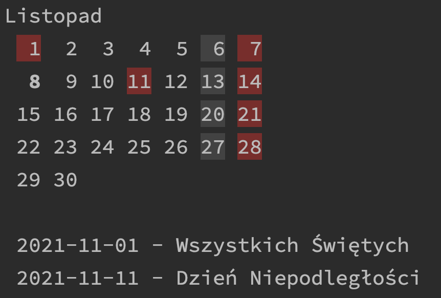

# Polish Holidays

PolishHolidays is a simple library that returns list of Polish holidays.

To use it with Maven:
```xml
<dependency>
    <groupId>pl.marcinchwedczuk</groupId>
    <artifactId>polish-holidays</artifactId>
    <version>1.0</version>
</dependency>
```

Basic usage:
```java
List<Holiday> holidays = HolidayCalendars
        .createPolishHolidaysCalendar()
        .holidaysForYear(2021);
```

`example` directory contains a more extensive example.
To run the example navigate to `example` directory and run:
```bash
../mvnw -f pom.xml clean package
java -jar ./target/example-1.0-SNAPSHOT-jar-with-dependencies.jar
```
This will start a simple calendar program:


### Building, etc.

This project uses Eclipse Code formatter. Setup instructions for IntelliJ:
https://github.com/krasa/EclipseCodeFormatter#instructions.
Code style (based on Google Java Styleguide) is stored in `eclipse-java-google-style.xml` file.


To compile and run tests execute:
```bash
./mvnw
```

Reformat source code:
```bash
./mvnw spotless:apply
```

Browse SpotBugs report:
```bash
./mvnw spotbugs:gui
```

Publish package to Maven Central:
```bash
./mvnw clean deploy -Psonatype
```